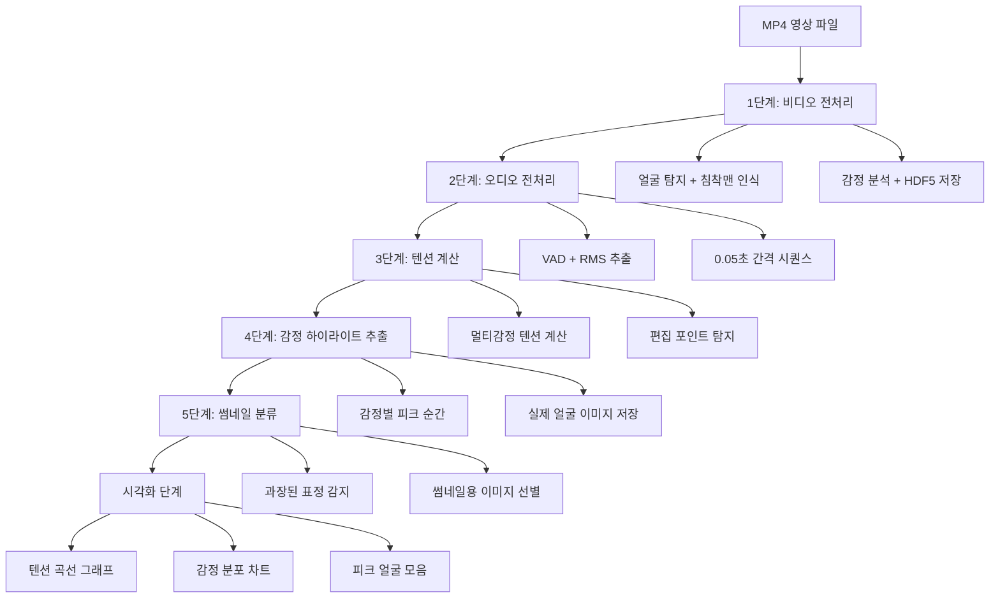

# 🎬 침착맨 AI 재미도 분석 파이프라인 완전 가이드

## 📋 **시스템 개요**

침착맨 영상에서 **실제로 재밌는 구간을 자동으로 찾아주는 AI 시스템**입니다. 비디오 전처리부터 시각화까지 전체 과정을 자동화하여 편집자의 업무를 단축시킵니다.

---

## 🔄 **전체 파이프라인 플로우**



---

## 🚀 **실행 방법**

### **기본 실행**

```bash
python .\pipeline\integrated_pipeline.py data\clips\funny\merged\f_013_진짜_90년대_돈가스_0.0_43.0.mp4
```

### **자동 모드 (단계별 대기 없음)**

```bash
python .\pipeline\integrated_pipeline.py --auto data\clips\funny\f_013_진짜_90년대_돈가스_0.0_43.0.mp4
```

### **대화형 모드 (파일 선택)**

```bash
python .\pipeline\integrated_pipeline.py
# → 파일명 입력 프롬프트 표시
```

---

## 📁 **디렉토리 구조**

```
outputs/
├─ preprocessed_data/                    # 전처리 결과
│  ├─ video_sequences/                   # 비디오 HDF5 파일들
│  ├─ audio_sequences/                   # 오디오 HDF5 파일들
│  └─ debug_faces/                       # 얼굴 이미지들
│     └─ chimchakman_[영상명]_[날짜]/
│        ├─ chimchakman/                 # 침착맨 얼굴만
│        └─ others/                      # 다른 사람 얼굴들
├─ tension_data/                         # 텐션 분석 JSON
├─ pipeline/                             # 파이프라인 결과
│  ├─ classification/                    # 썸네일 분류 결과  
│  ├─ highlights/                        # 감정 하이라이트
│  ├─ logs/                             # 처리 로그
│  └─ visualization/                     # 시각화 결과
│     └─ [영상명]/                      # 영상별 폴더
│        ├─ tension_curves.png           # 텐션 곡선
│        ├─ emotion_distribution.png     # 감정 분포
│        └─ emotion_peak_faces.png       # 피크 얼굴들
```

---

## ⚙️ **각 단계별 상세 분석**

### **🎥 1단계: 비디오 전처리 

**수행 작업:**

- 15프레임마다 샘플링 (FPS에 따라 ~0.25초 간격)
- MTCNN으로 얼굴 탐지 (배치 크기: 32)
- FaceNet으로 침착맨 얼굴만 필터링 (유사도 > 0.7)
- VA 감정 모델로 10차원 감정 특징 추출
- 224x224 얼굴 이미지들 저장

**출력:**

- `video_seq_[영상명]_[타임스탬프].h5`
- 얼굴 이미지 폴더: `chimchakman_[영상명]_[날짜]/`

**핵심 설정:**

```yaml
mtcnn:
  batch_size: 32
  image_size: 224
  prob_threshold: 0.9
face_recognition:
  similarity_threshold: 0.7
```

### **🎵 2단계: 오디오 전처리 **

**수행 작업:**

- 16kHz로 오디오 로드
- 0.05초 간격으로 RMS 값 추출
- Silero VAD로 음성 활동 탐지
- 발화 구간 통계 분석

**출력:**

- `audio_seq_[영상명]_[타임스탬프].h5`
- 발화 비율, 침묵 구간 통계

**핵심 알고리즘:**

```python
# RMS 계산 (0.05초 윈도우)
samples_per_interval = int(16000 * 0.05)  # 800 샘플
rms = sqrt(mean(segment^2))

# Silero VAD (torch.hub 기반)
speech_timestamps = get_speech_timestamps(audio, model, threshold=0.5)
```

### **⚡ 3단계: 텐션 계산 

**핵심 알고리즘:**

```python
# 멀티감정 텐션 (중립 제외 7감정 + Arousal×10)
emotion_tension = sum(emotions[0,1,2,3,4,6,7]) + emotions[9] * 10

# Voice RMS 텐션 (VAD 필터링)
voice_frames = rms[vad == 1]
audio_tension = mean(voice_frames) / 0.2 * 10  # 0~10 스케일

# 결합 텐션
if face_detected:
    combined = 0.7 * emotion + 0.3 * audio
elif voice_active:
    combined = 0.7 * prev_emotion + 0.3 * audio  
else:
    combined = prev_combined * decay_rate  # 0.95 or 0.85
```

**편집 포인트 탐지:**

- **하이라이트**: 평균 + 2σ 초과 구간
- **컷 포인트**: 텐션 변화율 > 0.2
- **저에너지**: 텐션 < 3.0

**출력:**

- `tension_[영상명]_[타임스탬프].json`

### **🎭 4단계: 감정 하이라이트 추출 

**수행 작업:**

- HDF5에서 감정 데이터 로드
- 각 감정별 상위 피크 순간 탐지
- 해당 시점의 실제 얼굴 이미지 찾기
- 감정별 폴더에 저장

**특징:**

```python
# 7개 감정 + Valence/Arousal 피크
emotions = ['Anger', 'Contempt', 'Disgust', 'Fear', 
           'Happiness', 'Sadness', 'Surprise', 'Valence', 'Arousal']

# 타임스탬프 매칭
timestamp_ms = int(timestamp * 1000)
filename_pattern = f"timestamp_{timestamp_ms:06d}_face0_chimchakman_*.jpg"
```

### **🖼️ 5단계: 썸네일 분류 

**수행 작업:**

- 기존 침착맨 얼굴 이미지들 스캔
- EfficientNet-B0 기반 이진 분류
- 과장된 표정(킹받는 순간) 감지
- 썸네일 후보 이미지들 별도 저장

**모델:**

- EfficientNet-B0 백본
- 이진 분류 (Normal vs Exaggerated)
- 신뢰도 임계값: 0.5

### **📊 시각화 단계 

**생성되는 그래프:**

1. **tension_curves.png** - 3개 텐션 곡선
    
    - 감정 텐션 (빨강)
    - 오디오 텐션 (청록)
    - 결합 텐션 + 하이라이트 포인트 (파랑)
    
2. **emotion_distribution.png** - 감정 분석
    
    - 파이차트: 감정 분포 비율
    - 막대그래프: 감정별 평균 강도
3. **emotion_peak_faces.png** - 실제 얼굴
    
    - 3x3 그리드로 9개 감정 피크 순간
    - 실제 타임스탬프와 감정값 표시

---
## 🔧 **주요 설정값**

### **얼굴 인식 정확도**

```yaml
face_recognition:
  similarity_threshold: 0.7    # 높일수록 엄격 (0.6~0.8)
  batch_size: 32              # GPU 메모리에 따라 조정
```

### **텐션 계산 민감도**

```yaml
tension:
  emotion_weight: 0.7         # 감정 비중
  audio_weight: 0.3           # 오디오 비중  
  arousal_multiplier: 10      # Arousal 강조
  
audio:
  voice_rms_max: 0.2          # RMS 정규화 최대값
  # voice_rms_norm = min(rms/0.2, 1.0) * 10
```

### **편집 포인트 민감도**

```yaml
editing:
  highlight_sensitivity: 2.0   # 낮을수록 더 많은 하이라이트
  change_threshold: 0.2        # 컷 포인트 감도
  low_tension_threshold: 3.0   # 저에너지 기준
```

---


## 📈 **결과 활용 방법**

### **1. 편집자 워크플로우**

1. `tension_curves.png`로 전체 에너지 흐름 파악
2. `highlights/` 폴더에서 핵심 순간들 확인
3. `classification/` 폴더에서 썸네일 후보 선택
4. JSON 파일의 타임스탬프로 정확한 편집 포인트 찾기

### **2. 자동 클립 생성**

```python
# JSON에서 하이라이트 구간 추출
with open('tension_result.json') as f:
    data = json.load(f)

highlights = data['edit_suggestions']['highlights']
for hl in highlights:
    start_time = hl['timestamp'] - 5  # 5초 전부터
    end_time = hl['timestamp'] + 5    # 5초 후까지
    # FFmpeg로 클립 추출
```

### **3. 유튜브 쇼츠 제작**

- 텐션 상위 20% 구간을 자동으로 20-30초 클립으로 편집
- 썸네일 분류 결과로 과장된 표정 자동 선택

---

## 🔍 **트러블슈팅**

### **자주 발생하는 문제들**

**1. 얼굴 인식률이 낮을 때**

```yaml
# 임계값 낮추기
face_recognition:
  similarity_threshold: 0.6  # 0.7 → 0.6
```

**2. 하이라이트가 너무 적을 때**

```yaml
# 민감도 높이기  
editing:
  highlight_sensitivity: 1.5  # 2.0 → 1.5
```

**3. GPU 메모리 부족**

```yaml
# 배치 크기 줄이기
mtcnn:
  batch_size: 16  # 32 → 16
```

**4. 처리 속도 느림**

```yaml
# 프레임 스킵 늘리기
video:
  frame_skip: 20  # 15 → 20 (더 성긴 샘플링)
```

---

## 🎯 **다음 단계 발전 방향**

> [!NOTE]
> - 다음 단계는 전처리한 데이터를 116차원의 입력샘플로 만들고 머신러닝 학습시키는 것

### **단기 개선 (1-2주)**

1. **실시간 처리**: 스트리밍 중 텐션 모니터링
2. **배치 처리**: 여러 영상 동시 처리
3. **설정 UI**: 웹 기반 파라미터 조정 도구

### **중기 확장 (1-3개월)**

1. **멀티 인물 지원**: 게스트와 침착맨 동시 분석
2. **장르별 모델**: 게임/토크/리액션별 특화
3. **실제 재미도 학습**: 유튜브 조회수/댓글 기반 지도학습

### **장기 비전 (6개월+)**

1. **완전 자동 편집**: 재밌는 구간 자동 연결
2. **개인화 추천**: 시청자 취향별 맞춤 하이라이트
3. **크로스 플랫폼**: 트위치, 아프리카TV 등 확장

---

**이 시스템은 단순한 분석 도구를 넘어서, 콘텐츠 제작 산업의 효율성을 혁신할 수 있는 실용적인 AI 솔루션입니다.** 🎯✨